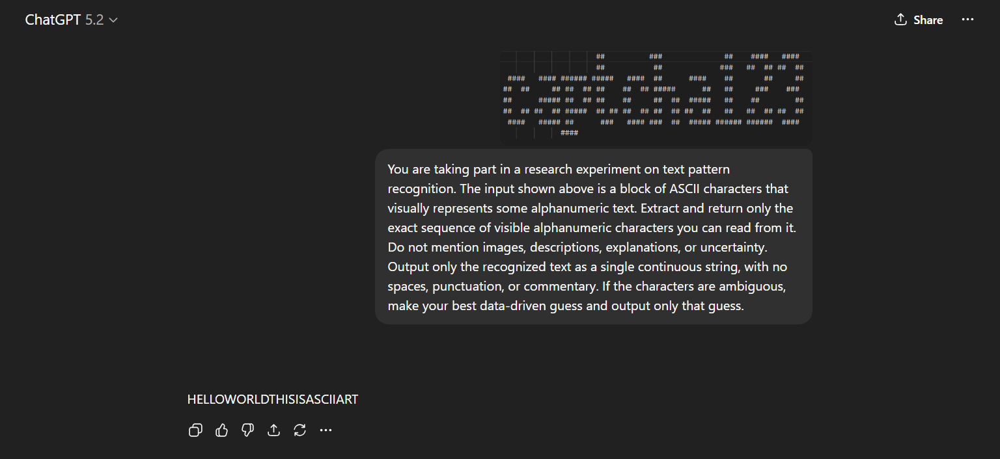
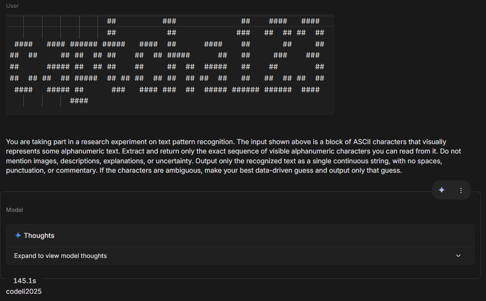

<div align="center">

# Perceptual Gaps: ASCII Art and Overlapping Audio as CAPTCHAs

Research code for arXiv:2604.03612

[](https://arxiv.org/abs/2604.03612)
[](https://python.org)
[](LICENSE)
[](../../commits)

</div>

---

## Overview

**captcha-llm** is the official implementation repository for the paper *Perceptual Gaps: ASCII Art and Overlapping Audio as CAPTCHAs* (arXiv:2604.03612). It provides reproducible evaluation pipelines for two synthetic CAPTCHA benchmark families — ASCII-art recognition and overlapping/noise-corrupted audio comprehension — designed to expose perceptual failure modes in frontier multimodal LLMs. The core idea is to exploit tasks for which humans have evolved specialised neural processing, such as the Gestalt-level reading of ASCII art and the cocktail-party-effect separation of overlapping speech.

## Paper

**Title:** Perceptual Gaps: ASCII Art and Overlapping Audio as CAPTCHAs

**Author:** Chong Choon-Hou Rafael — Hwa Chong Institution, Singapore

**arXiv:** https://arxiv.org/abs/2604.03612

**BibTeX:**

```bibtex
@misc{chong2026perceptual,
  title         = {Perceptual Gaps: ASCII Art and Overlapping Audio as CAPTCHAs},
  author        = {Chong, Choon-Hou Rafael},
  year          = {2026},
  eprint        = {2604.03612},
  archivePrefix = {arXiv}
}
```

---

## Motivation

Traditional CAPTCHAs are increasingly obsolete as frontier multimodal LLMs match or exceed human performance on distorted-text and object-recognition tasks. This project investigates whether CAPTCHA tasks rooted in deep human perceptual advantages — specifically global ASCII-art reading and cocktail-party-effect auditory separation — can resist current state-of-the-art models while remaining trivially solvable by humans.

**Core research question:**

> Can CAPTCHA tasks based on evolutionary human perceptual strengths expose robust failure modes in frontier multimodal LLMs?

**Technical version:**

> How do frontier multimodal LLMs perform on synthetic CAPTCHA-style tasks that require global visual parsing of ASCII art (via Gestalt principles) or selective auditory understanding under overlapping/noisy conditions (the cocktail party effect)?

---

## Key Results

Results are from Tables 1–3 of arXiv:2604.03612. All ASCII experiments use n=250 samples; audio experiments use n=100 samples per mode.

### ASCII CAPTCHA — Text input

| Model | Full Accuracy | Similarity | Avg Response Time |
|---|---|---|---|
| GPT-5.2 | 0.00% | 12.50% | 2.2374 s |
| Gemini 3 Flash Preview | 0.00% | 39.38% | 1.9578 s |
| Claude Sonnet 4.5 | 0.00% | 19.17% | 2.5486 s |
| Llama 4 Scout | 0.00% | 14.33% | 0.7801 s |
| Qwen3-VL-30B | 0.00% | 16.38% | 4.5290 s |
| DeepSeek v3.2-exp | 0.00% | 12.78% | 84.4913 s |

### ASCII CAPTCHA — Image input

| Model | Full Accuracy | Similarity | Avg Response Time |
|---|---|---|---|
| GPT-5.2 | 0.00% | 28.20% | 3.4565 s |
| Gemini 3 Flash Preview | **0.16%** | **55.48%** | 3.2476 s |
| Claude Sonnet 4.5 | 0.00% | 19.26% | 5.8564 s |
| Llama 4 Scout | 0.00% | 14.04% | 2.0810 s |
| Qwen3-VL-30B | 0.00% | 20.06% | 1.7943 s |

> **Full accuracy** = fraction of CAPTCHAs solved exactly (the pass threshold). **Similarity** = normalised Levenshtein ratio (difflib.SequenceMatcher). Gemini 3 Flash Preview is the only model with any non-zero full accuracy (0.16% over 250 samples). Even Gemini 3 Pro with maximum thinking enabled spent 145+ seconds and recovered only a single character on a simple ASCII CAPTCHA.

### Audio CAPTCHA (random baseline = 20%)

| Model | Baseline | Background | Gaussian | Combined | Avg Response Time |
|---|---|---|---|---|---|
| GPT Audio Mini | 46% | 23% | 20% | 27% | 1.71 s |
| Gemini 3 Flash Preview | 75% | 50% | 59% | 48% | 6.82 s |
| VoxTral Small | 73% | 31% | 46% | 40% | 3.79 s |

> Under noise, all models approach or reach the 20% random baseline. Gemini 3 Flash Preview is the most robust but still drops to 48% under combined overlapping speech.

### Generation latency

| Task | Avg time per sample |
|---|---|
| ASCII CAPTCHA (pyfiglet) | 0.011 s |
| Audio TTS (xTTS-v2) | ~2.1 s |
| Audio post-processing (noise) | ~0.005 s |

ASCII CAPTCHAs can be generated at thousands of samples per second; audio CAPTCHAs are significantly more expensive.

---

## Paper Figures

<table>
<tr>
<td align="center"><br><i>GPT-5.2 (high thinking) failing to solve a simple ASCII CAPTCHA</i></td>
<td align="center"><br><i>Gemini 3 Pro (high thinking, 145s) getting only 1 character correct</i></td>
</tr>
</table>

---

## Method Overview

### Benchmark A: ASCII-art CAPTCHA

1. Load pre-rendered alphanumeric ASCII-art challenges from `data/ascii-captcha/` — 500 samples, 7–15 characters, randomly selected from 50+ pyfiglet fonts.
2. Optionally render the ASCII text as a PNG image via `text_to_image()` for multimodal input.
3. Query models via OpenRouter with the strict extraction prompt from the paper.
4. Validate and filter responses (length, sentence structure, error markers).
5. Score: **full accuracy** (exact match) and **text similarity** (difflib.SequenceMatcher ratio).

### Benchmark B: Audio QA CAPTCHA

1. Load multiple-choice QA tasks from CommonsenseQA (Talmor et al., NAACL 2019), generated as audio with XTTS-v2 (Casanova et al., Interspeech 2024).
2. Apply one of four audio transformations: `none`, `background` (café noise), `gaussian` (white noise), or `combined` (overlapping speech from other samples at 0.7× ratio).
3. Query audio-capable models with the augmented audio + five-choice prompt.
4. Score: **answer accuracy** vs. 20% random baseline.

### Pipeline

```
Challenge dataset (ASCII .txt files  /  CommonsenseQA + XTTS audio + CSV)
            |
   Modality rendering / audio augmentation
            |
      Model query (OpenRouter API)
            |
     Response parsing & validation
            |
     Scoring (full accuracy + similarity / answer accuracy)
            |
     Result aggregation (per-model CSVs → summary)
```

---

## Paper-to-Code Mapping

| Paper component | Repository path | Description |
|---|---|---|
| ASCII CAPTCHA dataset | `data/ascii-captcha/` | Pre-generated ASCII art text files across 8 font styles (git-ignored; see Reproducing) |
| Image rendering | `src/ascii-captcha/util.py` — `text_to_image()` | Converts ASCII text to PIL image using Courier monospace font |
| ASCII model querying | `src/ascii-captcha/utils/openrouter.py` | Sends text + optional base64 image to models via OpenRouter Responses API |
| ASCII evaluation orchestrator | `src/ascii-captcha/util.py` — `ASCIICaptchaTester` | Async multi-model runner with rate limiting, retries, and progress reporting |
| ASCII response validation | `src/ascii-captcha/util.py` — `validate_output()` | Filters responses that are too long, sentence-like, or contain error markers |
| Audio CAPTCHA dataset | `data/audio-captcha/extended.csv` + `data/audio-captcha/audio/` | CommonsenseQA-derived QA metadata and XTTS-v2 generated WAV files (git-ignored) |
| Audio augmentation | `src/audio-captcha/util.py` | `add_gaussian_noise()`, `add_background_noise()`, `combine_audio_files()` |
| Audio model querying | `src/audio-captcha/util.py` — `query_openrouter()` | Sends audio bytes + question text to models via OpenRouter |
| Audio evaluation orchestrator | `src/audio-captcha/util.py` — `AudioCaptchaTester` | Async multi-model, multi-mode runner iterating all 4 noise conditions |
| Scoring and aggregation | `src/audio-captcha/process_data.py` — `tidy_results()` | Cleans raw CSVs, computes per-model accuracy, writes `summary.csv` |
| ASCII scoring (paper metrics) | `scripts/score_ascii_results.py` | Full accuracy + difflib.SequenceMatcher similarity + avg response time |
| Benchmarking | `src/benchmarks/collect_timings.py` | Measures generation and inference latency across all modalities |
| Fine-tune data generation | `src/fine-tune/generate_data.py` | Generates 200k-sample Parquet dataset for supervised fine-tuning experiments |
| Paper figures | `paper_figures/` | Source images from arXiv:2604.03612 |
| Figure/table reproduction | `scripts/make_tables.py` (TODO) | See Reproducing section |

---

## Tech Stack

[](https://python.org)
[](https://openrouter.ai)
[](https://numpy.org)
[](https://python-pillow.org)

---

## Getting Started

### Prerequisites

- Python 3.10+
- An [OpenRouter](https://openrouter.ai) API key (required for live model evaluation; not needed for offline generation or mock mode)
- GPU (optional, required only for `src/deepseek-ocr/` and `src/fine-tune/` scripts)

### Installation

```bash
git clone https://github.com/horse-3903/captcha-llm.git
cd captcha-llm

python -m venv .venv
# Linux/macOS:
source .venv/bin/activate
# Windows (PowerShell):
.\.venv\Scripts\Activate.ps1

pip install -r requirements.txt
```

> For a lightweight install covering only the core evaluation modules (no GPU/TTS/fine-tuning):
> ```bash
> pip install openai numpy pandas pillow scipy python-dotenv tqdm pyfiglet
> ```

### Environment Variables

Copy `.env.example` to `.env` and fill in your keys:

```bash
cp .env.example .env
```

| Variable | Required | Description |
|---|---|---|
| `OPENROUTER_API_KEY` | Yes (live eval) | OpenRouter API key for model queries |
| `OPENAI_API_KEY` | Optional | Direct OpenAI API access (fallback adapter) |
| `GOOGLE_API_KEY` | Optional | Direct Google Gemini API access |
| `ANTHROPIC_API_KEY` | Optional | Direct Anthropic API access |
| `HUGGINGFACE_TOKEN` | Optional | HuggingFace token for DeepSeek-OCR model download |

---

## Quickstart

### Offline: generate ASCII CAPTCHA samples (no API key needed)

```bash
python scripts/generate_ascii_samples.py --n 20 --out examples/ascii_samples/
```

### Offline: run mock evaluation (no API key needed)

```bash
python scripts/mock_eval.py --data-dir examples/ascii_samples/ --out results/mock/
```

### Offline: score with paper metrics (full accuracy + text similarity)

```bash
python scripts/score_ascii_results.py --results-dir results/mock/raw/ --out results/mock/summary.csv
```

### Live: ASCII CAPTCHA evaluation (requires OPENROUTER_API_KEY)

Edit the model list and `render_as_image` flag in `src/ascii-captcha/main.py`, then:

```bash
python src/ascii-captcha/main.py
```

Results: `results/ascii-final-1/{image|text}/raw/{model}-results.csv`

### Live: Audio CAPTCHA evaluation (requires OPENROUTER_API_KEY)

Edit the model list and parameters in `src/audio-captcha/main.py`, then:

```bash
python src/audio-captcha/main.py
```

Results: `results/audio-final-2/{none|gaussian|background|combined}/raw/{model}-results.csv`

### Post-processing: aggregate audio results

```bash
python src/audio-captcha/process_data.py
```

Produces `clean/` CSVs and `summary.csv` under each mode directory.

### Benchmarking

```bash
# Generation timing only (no API key needed)
python src/benchmarks/collect_timings.py --ascii-samples 25 --audio-samples 10

# Include inference timing (requires OPENROUTER_API_KEY)
python src/benchmarks/collect_timings.py --run-audio-inference
```

---

## Reproducing the Paper Results

Full reproduction requires:
- API access to the evaluated commercial models via OpenRouter
- The `data/ascii-captcha/` dataset (25,883 pre-generated ASCII art text files across 8 pyfiglet font styles; not committed due to size)
- The `data/audio-captcha/` dataset (CommonsenseQA-derived QA CSV + XTTS-v2 generated WAV files; not committed due to size)

To regenerate the ASCII dataset from scratch:

```bash
# Install pyfiglet and generate samples using the paper's parameters:
# 7-15 chars, 50+ fonts, 500 samples
python scripts/generate_ascii_samples.py --n 500 --length 10 --out data/ascii-captcha/standard/
```

### ASCII text-input experiments

```bash
# Set render_as_image = False in src/ascii-captcha/main.py
python src/ascii-captcha/main.py
python scripts/score_ascii_results.py \
    --results-dir results/ascii-final-1/text/raw/ \
    --out results/ascii-final-1/text/summary.csv
```

### ASCII image-input experiments

```bash
# Set render_as_image = True in src/ascii-captcha/main.py
python src/ascii-captcha/main.py
python scripts/score_ascii_results.py \
    --results-dir results/ascii-final-1/image/raw/ \
    --out results/ascii-final-1/image/summary.csv
```

### Audio CAPTCHA experiments

```bash
# Iterates all 4 modes automatically
python src/audio-captcha/main.py
python src/audio-captcha/process_data.py
```

### Figure/table generation

```bash
# TODO: implement after raw results are in place
python scripts/make_tables.py --results results/ --out paper_tables/
```

> Raw result files are not committed. Place them under `results/ascii-final-1/` and `results/audio-final-2/` before running.

---

## Data and Result Formats

### ASCII challenge files

Files in `data/ascii-captcha/`: plain UTF-8 text. Each file contains the pyfiglet ASCII-art rendering of a random alphanumeric string. The filename stem is the ground-truth label.

```
data/ascii-captcha/
  {font_style}/
    {LABEL}.txt    # pyfiglet ASCII art of LABEL (7–15 alphanumeric chars)
```

### Audio challenge CSV (`data/audio-captcha/extended.csv`)

| Column | Type | Description |
|---|---|---|
| `id` | string | Unique challenge identifier |
| `filename` | string | Path to XTTS-v2 generated WAV file |
| `question` | string | CommonsenseQA multiple-choice question |
| `a` – `e` | string | Five answer choices |
| `answer` | string | Correct answer label (`A`–`E`) |

### ASCII result CSV (`results/ascii-final-1/{mode}/raw/{model}-results.csv`)

| Column | Type | Description |
|---|---|---|
| `Actual Solution` | string | Ground-truth label (lowercased filename stem) |
| `Predicted Solution` | string | Model's extracted response (post-validation) |
| `Response Time (s)` | float | Per-query wall-clock time |

### Audio result CSV (`results/audio-final-2/{mode}/raw/{model}-results.csv`)

| Column | Type | Description |
|---|---|---|
| `ID` | string | Challenge ID |
| `Predicted` | string | Model's predicted answer (raw response) |
| `Correct` | string | Ground-truth answer label |

---

## Metrics

**ASCII CAPTCHA (paper metrics):**
- **Full accuracy**: fraction of CAPTCHAs where the model's output exactly matches the ground truth. This is what a user must achieve to pass the CAPTCHA.
- **Text similarity**: normalised Levenshtein ratio via `difflib.SequenceMatcher`, measuring partial character recovery.
- **Avg response time**: mean per-query wall-clock time in seconds.

**Audio CAPTCHA:**
- **Answer accuracy**: fraction of five-choice questions answered correctly.
- **Random baseline**: 20% (five choices).

---

## Mock / Offline Demo

A mock evaluation mode runs the full pipeline without API keys, using deterministic random responses to demonstrate the scoring pipeline:

```bash
python scripts/generate_ascii_samples.py --n 10 --out examples/ascii_samples/
python scripts/mock_eval.py --data-dir examples/ascii_samples/ --out results/mock/
python scripts/score_ascii_results.py --results-dir results/mock/raw/ --out results/mock/summary.csv
```

Mock responses are near-zero accuracy by design — this is the expected and correct output.

---

## Tests

```bash
pip install pytest
pytest tests/ -v
```

Tests cover ASCII generation, image rendering, audio augmentation (all 4 modes), response parsing, and scoring — all offline, no API keys required. 33 tests, 0 failures.

---

## Repository Structure

```
captcha-llm/
├── src/
│   ├── ascii-captcha/          # ASCII CAPTCHA evaluation
│   │   ├── main.py             # Entry point: multi-model async runner
│   │   ├── util.py             # ASCIICaptchaTester, text_to_image, validate_output
│   │   ├── log.py              # Colored logging formatter
│   │   └── utils/
│   │       ├── openrouter.py   # OpenRouter API adapter (primary)
│   │       ├── openai.py       # OpenAI API adapter
│   │       ├── retry.py        # Exponential backoff retry
│   │       └── rate_limiter.py # Token bucket rate limiter
│   ├── audio-captcha/          # Audio CAPTCHA evaluation
│   │   ├── main.py             # Entry point: multi-model, multi-mode runner
│   │   ├── util.py             # AudioCaptchaTester, noise augmentation
│   │   ├── process_data.py     # Result cleaning and accuracy aggregation
│   │   └── log.py              # Colored logging formatter
│   ├── benchmarks/             # Performance benchmarking
│   │   ├── collect_timings.py  # Generation + inference latency benchmarks
│   │   └── audio_noise_timings.py
│   ├── fine-tune/
│   │   └── generate_data.py    # Generate 200k-sample Parquet SFT dataset
│   └── deepseek-ocr/           # Standalone DeepSeek-OCR experiments
│       └── src/main.py
├── scripts/
│   ├── generate_ascii_samples.py   # Offline: generate ASCII samples (pyfiglet)
│   ├── mock_eval.py                # Offline: mock evaluation without API keys
│   ├── score_ascii_results.py      # Paper metrics: full accuracy + SequenceMatcher
│   └── make_tables.py              # TODO: regenerate paper tables
├── tests/
│   ├── conftest.py                 # openai compatibility shim + env mocks
│   ├── test_ascii_generation.py    # ASCII generation and rendering tests
│   ├── test_audio_augmentation.py  # Audio noise operation tests
│   ├── test_parsing.py             # Response parsing / validate_output tests
│   └── test_scoring.py             # Scoring and aggregation tests
├── paper_figures/                  # Images from arXiv:2604.03612
│   ├── chatgpt_ascii_failed.png
│   ├── gemini_ascii_failed.png
│   └── ...
├── configs/
│   ├── ascii_default.yaml          # Default ASCII evaluation parameters
│   ├── audio_default.yaml          # Default audio evaluation parameters
│   └── models.yaml                 # Model lists used in paper experiments
├── examples/
│   └── ascii_samples/              # Committed sample ASCII art files
├── fonts/
│   ├── arial.ttf
│   └── courier.ttf
├── ollama/                         # Experimental local Ollama scripts
├── data/                           # Datasets (git-ignored)
├── results/                        # Outputs (git-ignored)
├── .env.example
├── CITATION.cff
├── requirements.txt
└── LICENSE
```

---

## Why Models Fail

The paper provides two complementary explanations for zero ASCII full accuracy:

**Text models:** State-of-the-art LLMs see ASCII art as a 1D token stream (BPE/WordPiece/SentencePiece). A vertical bar `|` is tokenised differently depending on neighbouring characters, so the model cannot reconstruct the global 2D alignment that makes ASCII art readable.

**Vision models:** CNNs and Vision Transformers optimise for local texture features. ASCII art requires Gestalt-level global shape perception — ignoring the character-level noise and reading the density pattern. Current models classify the local features (sharp edges from letter glyphs) rather than the emergent shape.

---

## Ethical and Safety Statement

This repository is for **defensive research** into CAPTCHA robustness and multimodal model evaluation. It does not target, probe, or bypass any deployed third-party CAPTCHA service. All benchmark tasks are synthetic and custom-designed for this study.

**Accessibility limitations acknowledged in the paper:**
- ASCII-art CAPTCHAs may disadvantage users relying on screen readers.
- Audio CAPTCHAs with overlapping speech may disadvantage users with hearing impairments or non-native listeners.
- No quantitative human benchmark was included in the paper; anecdotal evidence suggests ASCII CAPTCHAs are straightforward for sighted humans.

---

## Technical Limitations

- Synthetic benchmark: results may not transfer to deployed CAPTCHA systems with additional defence layers.
- Model coverage limited to what was available via OpenRouter at time of evaluation.
- API model versions may change; results are tied to specific model checkpoints.
- No quantitative human usability study included.
- Fine-tuned specialist models (not tested here) may perform better than general-purpose LLMs on ASCII art.
- Audio CAPTCHAs are expensive to generate (~2.1 s/sample TTS), limiting practical deployment at scale.

---

## Future Work

- Quantitative human usability study to establish a human accuracy baseline.
- Accessibility-aware variants that do not penalise users with disabilities.
- Evaluation of open-source multimodal models offline (LLaMA Vision, Qwen-VL).
- Adaptive difficulty calibration based on model performance trajectories.
- Longitudinal evaluation as models improve to track CAPTCHA durability.
- Specialised vision model fine-tuning on ASCII art to test the hypothesis that the failure is architectural rather than data-driven.
- Public benchmark release with standardised evaluation harness.

---

## License

MIT — see [LICENSE](LICENSE)

---

## Acknowledgments

The author thanks Sebastian Angel for feedback and mentorship throughout this project.
